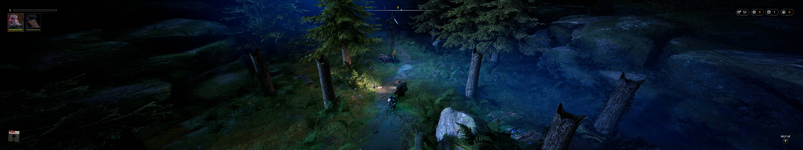

## Mutant Year Zero: Road to Eden field of view

The tool corrects the field of view decrease at 21:9 and wider resolutions and allows to manipulate the game field of view at any resolution in real time.

1. [Download](/../../releases) and unpack the archive.
2. Launch the game first, followed by the tool.
3. Press the hotkeys as shown.

All trainers based on CE components may trigger some anti-virus software.

Tested on the latest Epic Games Store version at 2560x1080, 1920x1080 and 5760x1080.

